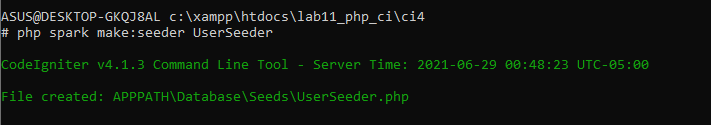

## Pratikum 12

## Membuat table dan database

##  Konfigurasi koneksi database
Selanjutnya membuat konfigurasi untuk menghubungkan dengan database server. 
Konfigurasi dapat dilakukan dengan du acara, yaitu pada file app/config/database.php
atau menggunakan file .env. Pada praktikum ini kita gunakan konfigurasi pada file .env. 

## Membuat Model
Selanjutnya adalah membuat Model untuk memproses data Artikel. Buat file baru pada 
direktori app/Models dengan nama ArtikelModel.php

## Membuat Controller
Buat Controller baru dengan nama Artikel.php pada direktori app/Controllers.

## Membuat View
Buat direktori baru dengan nama artikel pada direktori app/views, kemudian buat file 
baru dengan nama index.php.

Selanjutnya buka browser kembali, dengan mengakses url http://localhost:8080/artikeL

Belum ada data yang diampilkan. Kemudian coba tambahkan beberapa data pada 
database agar dapat ditampilkan datanya.

Refresh kembali browser, sehingga akan ditampilkan hasilnya.

## Membuat Tampilan Detail Artikel
Tampilan pada saat judul berita di klik maka akan diarahkan ke halaman yang berbeda. 
Tambahkan fungsi baru pada Controller Artikel dengan nama view().

## Membuat View Detail
Buat view baru untuk halaman detail dengan nama app/views/artikel/detail.php.

## Membuat Routing untuk artikel detail
Buka Kembali file app/config/Routes.php, kemudian tambahkan routing untuk artikel 
detail.

refresh kembali browser, dan liat hasilnya

## Membuat Menu Admin
Menu admin adalah untuk proses CRUD data artikel. Buat method baru pada 
Controller Artikel dengan nama admin_index().

## Selanjutnya buat view untuk tampilan admin dengan nama admin_index.php

Tambahkan routing untuk menu admin 

Akses menu admin dengan url http://localhost:8080/admin/artikel

## Menambah Data Artikel
Tambahkan fungsi/method baru pada Controller Artikel dengan nama add().

Kemudian buat view untuk form tambah dengan nama form_add.php

refresh browser dan liat hasilnya

## Mengubah Data
Tambahkan fungsi/method baru pada Controller Artikel dengan nama edit().

Kemudian buat view untuk form tambah dengan nama form_edit.php

refresh browser dan liat hasilnya

## Menghapus Data
Tambahkan fungsi/method baru pada Controller Artikel dengan nama delete().

## Pratikum 13

## Langkah - Langkah Pratikum
Persiapan.
Untuk memulai membuat modul Login, yang perlu disiapkan adalah database server 
menggunakan MySQL. Pastikan MySQL Server sudah dapat dijalankan melalui 
XAMPP.

## Membuat Tabel User

## Membuat Model User
Selanjutnya adalah membuat Model untuk memproses data Login. Buat file baru pada 
direktori app/Models dengan nama UserModel.php

## Membuat Controller User
Buat Controller baru dengan nama User.php pada direktori app/Controllers.
Kemudian tambahkan method index() untuk menampilkan daftar user, dan method 
login() untuk proses login.

## Membuat View Login
Buat direktori baru dengan nama user pada direktori app/views, kemudian buat file 
baru dengan nama login.php.

## Membuat Database Seeder
Database seeder digunakan untuk membuat data dummy. Untuk keperluan ujicoba modul 
login, kita perlu memasukkan data user dan password kedaalam database. Untuk itu buat 
database seeder untuk tabel user. Buka CLI, kemudian tulis perintah berikut:

Selanjutnya, buka file UserSeeder.php yang berada di lokasi direktori 
/app/Database/Seeds/UserSeeder.php kemudian isi dengan kode berikut:

Selanjutnya buka kembali CLI dan ketik perintah berikut:

## Uji Coba Login
Selanjutnya buka url http://localhost:8080/user/login seperti berikut:

## Menambahkan Auth Filter
Selanjutnya membuat filer untuk halaman admin. Buat file baru dengan nama Auth.php
pada direktori app/Filters.

Selanjutnya buka file app/Config/Filters.php tambahkan kode berikut:

Selanjutnya buka file app/Config/Routes.php dan sesuaikan kodenya

##  Percobaan Akses Menu Admin
Buka url dengan alamat http://localhost:8080/admin/artikel ketika alamat tersebut 
diakses maka, akan dimuculkan halaman login.

## Fungsi Logout
Tambahkan method logout pada Controller User seperti berikut:

## Pratikum 14

## Langkah-langkah Praktikum
# Membuat Pagination
Pagination merupakan proses yang digunakan untuk membatasi tampilan yang panjang 
dari data yang banyak pada sebuah website. Fungsi pagination adalah memecah 
tampilan menjadi beberapa halaman tergantung banyaknya data yang akan ditampilkan 
pada setiap halaman.
Pada Codeigniter 4, fungsi pagination sudah tersedia pada Library sehingga cukup 
mudah menggunakannya.
Untuk membuat pagination, buka Kembali Controller Artikel, kemudian modifikasi 
kode pada method admin_index seperti berikut.

Kemudian buka file views/artikel/admin_index.php dan tambahkan kode berikut
dibawah deklarasi tabel data

<?= $pager->links(); ?>

Selanjutnya buka kembali menu daftar artikel, tambahkan data lagi untuk melihat 
hasilnya.

## Membuat Pencarian
Pencarian data digunakan untuk memfilter data.
Untuk membuat pencarian data, buka kembali Controller Artikel, pada method 
admin_index ubah kodenya seperti berikut

Kemudian buka kembali file views/artikel/admin_index.php dan tambahkan form 
pencarian sebelum deklarasi tabel seperti berikut:

<form method="get" class="form-search">
 <input type="text" name="q" value="<?= $q; ?>" placeholder="Cari data">
 <input type="submit" value="Cari" class="btn btn-primary">
</form>

Dan pada link pager ubah seperti berikut.

<?= $pager->only(['q'])->links(); ?>

Selanjutnya ujicoba dengan membuka kembali halaman admin artikel, masukkan kata 
kunci tertentu pada form pencarian.

## Upload Gambar
Menambahkan fungsi unggah gambar pada tambah artikel. Buka kembali Controller 
Artikel, sesuaikan kode pada method add seperti berikut:

Kemudian pada file views/artikel/form_add.php tambahkan field input file seperti 
berikut.

 

 <input type="file" name="gambar">

Dan sesuaikan tag form dengan menambahkan ecrypt type seperti berikut.

<form action="" method="post" enctype="multipart/form-data">

Ujicoba file upload dengan mengakses menu tambah artikel

  
  
  

