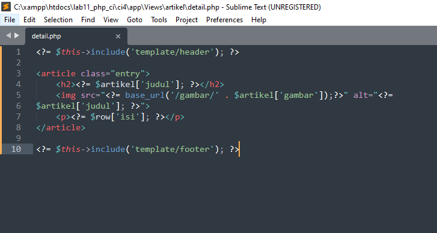
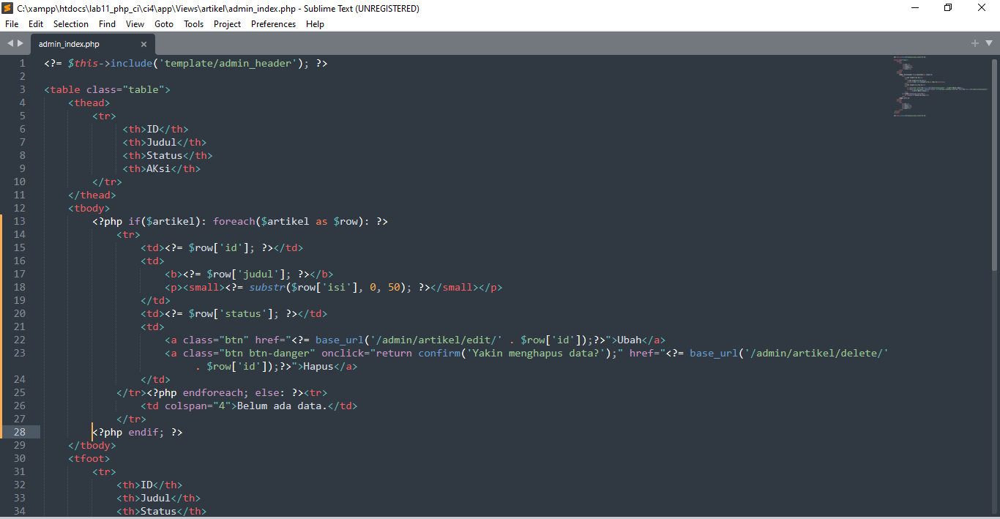
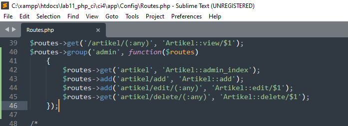

## Pratikum 12

## Membuat table dan database

##  Konfigurasi koneksi database
Selanjutnya membuat konfigurasi untuk menghubungkan dengan database server. 
Konfigurasi dapat dilakukan dengan du acara, yaitu pada file app/config/database.php
atau menggunakan file .env. Pada praktikum ini kita gunakan konfigurasi pada file .env. 

## Membuat Model
Selanjutnya adalah membuat Model untuk memproses data Artikel. Buat file baru pada 
direktori app/Models dengan nama ArtikelModel.php

## Membuat Controller
Buat Controller baru dengan nama Artikel.php pada direktori app/Controllers.

## Membuat View
Buat direktori baru dengan nama artikel pada direktori app/views, kemudian buat file 
baru dengan nama index.php.

Selanjutnya buka browser kembali, dengan mengakses url http://localhost:8080/artikeL

Belum ada data yang diampilkan. Kemudian coba tambahkan beberapa data pada 
database agar dapat ditampilkan datanya.

Refresh kembali browser, sehingga akan ditampilkan hasilnya.

## Membuat Tampilan Detail Artikel
Tampilan pada saat judul berita di klik maka akan diarahkan ke halaman yang berbeda. 
Tambahkan fungsi baru pada Controller Artikel dengan nama view().

## Membuat View Detail
Buat view baru untuk halaman detail dengan nama app/views/artikel/detail.php.

## Membuat Routing untuk artikel detail
Buka Kembali file app/config/Routes.php, kemudian tambahkan routing untuk artikel 
detail.

refresh kembali browser, dan liat hasilnya

## Membuat Menu Admin
Menu admin adalah untuk proses CRUD data artikel. Buat method baru pada 
Controller Artikel dengan nama admin_index().

## Selanjutnya buat view untuk tampilan admin dengan nama admin_index.php

Tambahkan routing untuk menu admin 

Akses menu admin dengan url http://localhost:8080/admin/artikel

## Menambah Data Artikel
Tambahkan fungsi/method baru pada Controller Artikel dengan nama add().

Kemudian buat view untuk form tambah dengan nama form_add.php

refresh browser dan liat hasilnya

## Mengubah Data
Tambahkan fungsi/method baru pada Controller Artikel dengan nama edit().

Kemudian buat view untuk form tambah dengan nama form_edit.php

refresh browser dan liat hasilnya

## Menghapus Data
Tambahkan fungsi/method baru pada Controller Artikel dengan nama delete().

Sekian dan terima kasih

